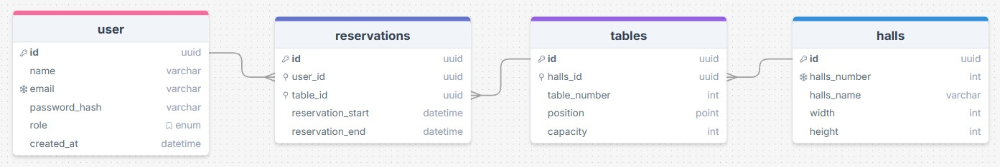

# asp.net-minailo-kn-23-1

У цьому репозиторії містяться лабораторні роботи з предмету <Розробка WЕB-застосунків з використанням технології ASP.net> групи <КН-23-1> <Міняйла Марка Олегович>

##### 

##### **Тема:**

Система для бронювання місць у ресторані: Система, де користувачі можуть перевіряти доступність столиків та бронювати їх.

##### **Функції проекту:**

* Реєстрація та авторизація користувача
* Перегляд доступних столиків
* Бронювання столика
* Перегляд бронювань
* Управління столиками (для адміністратора)

##### **Схема бази даних:**

